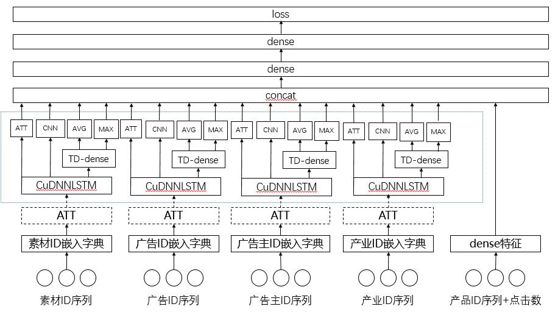

# tencent-ad-competition-2020
2020腾讯广告算法大赛-用户画像

# 团队介绍
* 这是我们团队第一次参加广告类型的算法大赛，本次比赛给予了我们学习与成长的机会，开拓了我们的视野和思路，积累了很多比赛的经验，感谢大赛组委会、老师和同学的帮助与支持，我们团队成员主要包括：
    * 雨悸痴梦 东南大学
    * 白猫尾 东南大学
* 本次比赛站在了前辈的肩膀上完成，同时也跟大赛的其它选手进行了交流与学习，主要参考：
    * https://github.com/chizhu/yiguan_sex_age_predict_1st_solution
    * https://www.tensorflow.org/
* 大赛链接：
    * https://algo.qq.com/
* 开源地址：
    * https://github.com/xingchao92/tencent-ad-competition-2020

# 赛题介绍
* 本赛题属于用户画像领域的经典问题，本质是通过用户的行为、广告的画像来探索用户的性别和年龄，在工业界具有极高的应用价值
* 这类赛题不同于我们擅长的CV领域的比赛，更加侧重对于业务、用户数据的理解、挖掘，以及特征工程的构建，极具挑战性

# 数据理解
* 用户侧数据：用户ID、性别、年龄
* 广告画像：素材ID、广告ID、广告主ID、产品ID、产品类别、所属行业
* 用户行为日志：用户ID、素材ID、点击日期、点击次数
* 训练集规模初赛90万，复赛300万，测试集规模100万
* 测试集不包括用户性别和年龄数据

# 评价指标
* 大赛组委会根据测试数据划分A、B榜
* 利用年龄和性别预测的准确度加和进行最终的评分

# 特征工程
* 该问题可以采用NLP领域的方法进行建模、求解
* 根据用户的行为日志，构建用户的点击素材ID序列、广告ID序列、广告主ID序列、产品ID序列、所属行业序列(\\\\N使用0填充)
* 根据click-times，对序列中的ID进行重复，同时对序列按照时间的升序进行排列
* 采用word2vec(https://radimrehurek.com/gensim/models/word2vec.html) 训练素材ID序列、广告ID序列、广告主ID序列、产品ID序列、所属行业序列的embedding，得到向量字典，主要训练参数如下：
    * 采用sg训练，window size为15
    * word embedding向量为256
    * 迭代次数为30左右
* 采用countvector(https://scikit-learn.org/stable/modules/generated/sklearn.feature_extraction.text.CountVectorizer.html) 获取每个用户的产品ID序列的dense特征，向量长度为128
* 统计类特征：
    * 每个用户的点击总数

# 模型介绍
* 我们团队使用的模型结构示意如下（模型有一个演进实验的过程，最终结果需要Ensemble）：  

  

从图中可以看到基本的网络结构：
* ATT表示self-attention层，其中Embedding层上的ATT层在有的模型中有，有的模型中没有，实验效果发现加上会有几个千的提升
* 在复赛阶段，我们尝试了多层LSTM，如图中的虚框所示，在每层LSTM的输出都会记录下来，到concat层进行拼接，得到最终的结果
* 使用了gelu激活函数
* 采用20分类进行loss构建，训练模型得到二十维分布之后，对联合概率分布进行求和，得到最终年龄和性别的概率分布

# 结果集成
* 结果集成尝试过权重搜索、stacking等方法
* 最终实验效果较好的结果主要是训练多个效果相差不大的异构模型，预测结果分布相加求平均后进行预测
    
    
# 思考与总结
* 特征工程非常重要，模型的输入决定了模型的天花板，要善于挖掘潜在的特征，比如节假日特征，每一个广告的统计数据，叉乘特征等
* MASK没有使用到，click-times可以作为mask使用，multi-head这块没有进行调参
* 数据增强，有的用户的点击序列是很长的，在训练的时候可以对数据进行增强，比如每个epoch训练的时候都可以对数据序列进行随机shuffle和随机截断
* 模型训练的时候也做的不够细致，训练embedding词表可以进行一些词表的截断，选择有效词进行学习，最终接LSTM的时候可以将embedding进行拼接，提升训练的效率和特征的表达能力等
* 模型的设计，多层优于少层，拼接的concat向量能够决定模型的好坏
* loss的设计上可以考虑多任务loss，可能效果要比20分类的效果好
* 结果集成，尝试了权重搜索和stacking，感觉是打开方式不太对，效果不如直接加权平均效果好
  
  P.S. 赛题第一名解决方案请移步：https://mp.weixin.qq.com/s/-lizDyP2y357plcG1M64TA?from=singlemessage&scene=1&subscene=10000&clicktime=1597564755&enterid=1597564755
